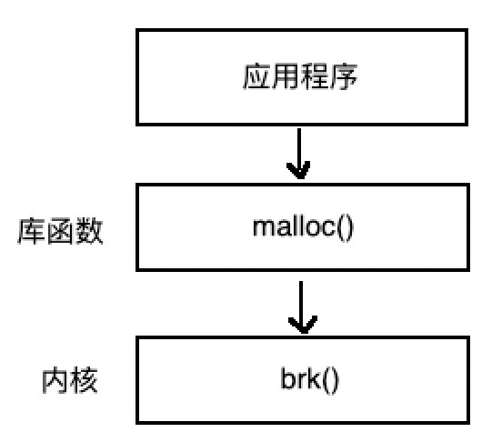

## Android内核原理解析之我见——Binder（一）预备知识

### 前言
Binder是Android系统内最常见的跨进程方式，作为一名Android系统/应用开发工程师，我们无时无刻不在与Binder机制打交道，例如：context.getSystemService(Context.ACTIVITY_SERVICE)、activity.startActivity()等。可以说，如果没有Binder，就没有Android操作系统，它是Android操作系统的血液，将各个原本孤立、封闭的进程紧密衔接起来，保证整个体系的良好运行。Binder是如此之重要，但它也是极其简单，因为经过Google的完美封装，我们几乎感觉不到它的存在。正因为如此，Binder才如此神秘，我们也应该更应该加强对其的了解。那么，Binder到底是什么呢？我们应该怎么去学习它呢？本文将分三到四个系列，由浅入深，剖析一下Binder的内在原理。

### 预备知识

Android内核是基于Linux内核移植过来的，虽然Binder并不是Linux中运用的技术，但Google通过利用Linux的**动态内核可加载模块** （Loadable Kernel Module，LKM）技术，将单独编译好的Binder模块集成进内核中，内核在运行时会链接这一模块并将其视为内核的一部分（Binder驱动——Binder Driver）。这样，Android系统就可以为上层提供Binder机制，实现其独有的跨进程通信技术。
那么，Google如此费尽心机的集成Binder到Android中，到底是为什么呢？换句话说，我们已经知道Android内核是基于Linux内核而演变而来，而Linux内核自身已经拥有了非常丰富的、多样的跨进程通信技术，为何还需要使用Binder呢？很多文章都对此做出来解释，主要原因如下：
- 性能好：数据拷贝次数仅为1次，而管道、消息队列、Socket都需要2次
- 稳定性好：基于C/S架构，目标明确，而共享内存容易产生死锁、线程不同步等问题
- 安全：基于C/S架构，容易获取双方的UID/PID，进行权限验证，而Linux上的跨进程通信技术无法获得可靠UID/PID
- 语言层面：
- 公司战略：

其实我们总结起来通俗的解释就是，Binder是Android系统基于自身的特点开发，服务场景主要为**system_server进程与上层（Framework层、App层）的IPC**，而对于其他场景，Android因地制宜的采用了原有的IPC技术，例如：++Zygote进程的IPC采用的是Socket（套接字）机制，Android中的Kill Process采用的signal（信号）机制++。我们只有在对传统的IPC通信技术有了一定程度的了解之后，再学习并对比Binder，才能更好地体会出上述的Binder几大优势。

#### 操作系统的内存管理和进程间的保护
##### 内存管理
虚拟内扩展了与物理内存，使相对紧缺的内存资源得到了扩展。虚拟内存概念本身对理解Binder并无影响，但实现虚拟内存的3种不同地址空间的概念，确对理解Binder至关重要。
###### 1. 逻辑地址
顾名思义，是一种建立在逻辑上的地址空间，也成为“相对地址“。操作系统对应用屏蔽底层物理地址，应用仅需关心系统提供给它的地址空间内范围内的地址信息。它由2部分组成：段选择符（segment）+ 偏移量（Offset）。其中segment格式如下：

- 一个段选择符提供了段描述符表（TI）和偏移量（INDEX）
- TI（Table Indicator）有0/1两种值，分别指明当前段地址空间要使用**GDT**（Global Descriptor Table）表还是**LDT**（Local Descriptor Table）表，两种表的地址分别存储在**GDTR**寄存器和**LDPR**寄存器中
- INDEX则指明需要使用表（GDTR、LDPR）中哪个序号的段描述符，注意这个偏移量跟上面的Offset不一样，一个属于段选择符内部构成元素，一个是与段选择符并列级别的元素
- RPL提供段保护信息
- Tip：Linux中还有一个IDT（Interrupt Descriptor Table）表，用于保存定义中断或异常处理过程的段描述符，相应的CPU也有IDTR寄存器。因此共有GDT、LDT、IDT三种类型的表

###### 2. 线性地址
是逻辑地址到物理地址变换之间的中间层。如果没有分页机制，那么线性地址就对应着物理地址，是一个一维的数组；如果有分页机制，那么线性地址仅仅相对看起来是线性的，实际上在物理内存的分配可能各式各样。线性地址空间由逻辑地址分段转换后形成：

- 根据TI值得知应该使用GDT/LDT，随后去GDTR/LDTR寄存器获取表格首地址
- 根据INDEX字段获取对应段描述符，进而获得段的基地址
- 基地址+段内偏移获得线性地址

###### 3. 物理地址
逻辑地址转换为线性地址后，还需要经过分页机制，才能最终转换为物理址。分页机制将线性地址和物理地址都划分成极小的内存块（1K），称为页面（++其实，可以将分段机制看成特殊的分页机制，页是固定大小的内存块，而段的长度与存放在其中的代码/数据相同++）。
分页机制通过二级页表结构最终确定物理地址：页目录+页面+偏移量。++分页机制根分段机制也很类似，页目录（CR3定位）可以看成是GDTR和LDTR的拓展（2个拓展为2^10），页表就是对应的GDT和LDT，找到表内对应的基地址后，再根据页内偏移就可以最终确定物理地址++。如下图：

因此，一块看起来连续的线性地址空间，实际上在物理硬盘中可能是分散的碎片块：

上图中，线性地址中的1、2、3、4、5、8都对应着物理内存地址，其中1、4、8还可以指向同一快物理地址。而6和7没有物理地址与之对应，说明它们并不在内存中，因此访问改地址时会产生一个“缺页中断”，操作系统根据相应算法为其分配地址空间。~~关于中断的知识点本文不予讲解~~

总结起来整个过错就是：

 

##### 进程保护
###### 1. 任务之间的保护
由于操作系统通过分段和分页技术阻止了每个进程直接操作物理内存，因此即使多个不同的任务拥有相同的逻辑地址空间，操作系统依然会将它们映射到不同的物理地址上，从而隔绝不同的任务进程。当然，操作系统也可以让多个不同进程的逻辑地址映射到同一块物理地址上，这就是本文后面要讲的共享内存技术。当程序对错误内存空间进行了一次非期望的引用，保护机制可以阻止该操作饼报告。

###### 2. 特权级保护
- 每个任务都有一个等级，Linux中共有4个等级，0是最高级，例如内核态任务，3是最低级，例如用户态任务。
- 每个程序允许访问同级别或更低级别的数据段，访问高级别会引发一个异常。
- 每个等级都有自己的程序栈，避免共享栈带来问题。切换不同等级执行，堆栈段也会随之改变。

~~保护机制分为段级保护和页级保护，详情与本文无关，不予讲解~~

###### 3. 系统调用
系统调用是Linux内核与上层应用通信的唯一接口。用户程序直接或间接的向调用**内核中断 int 0x80**，并在**eax寄存器**中指定**系统调用功能号**，即可使用内核资源。而系统调用的参数可以依次存放在**ebx、ecx、edx**中。brk()、write()、read()以及后面要提到的**mmap()** API，都是常见的系统调用。

 

使用系统调用就必然涉及到Linux用户态和内核态的转换。如果一个中断（int 0x80）由用户代码产生，该中断会引起CPU特权等级由3变化为0，而前面已经介绍过：任务切换等级会改变其堆栈段，因此CPU会进行用户态堆栈到内核态堆栈的切换操作。
- 根据当前任务确定内核态堆栈
- 将原用户态堆栈资源，如指针ss和esp等亚茹内核态堆栈
- 进入内核并执行内核中的中断服务代码
- 根据内核态堆栈执行内核代码
- 退出内核程序返回用户程序时，恢复用户态堆栈

由于切换状态过程中要不断保存和恢复上下文环境，因此内核态和用户态的切换是相对消耗资源的操作。

#### Linux进程间通信机制

